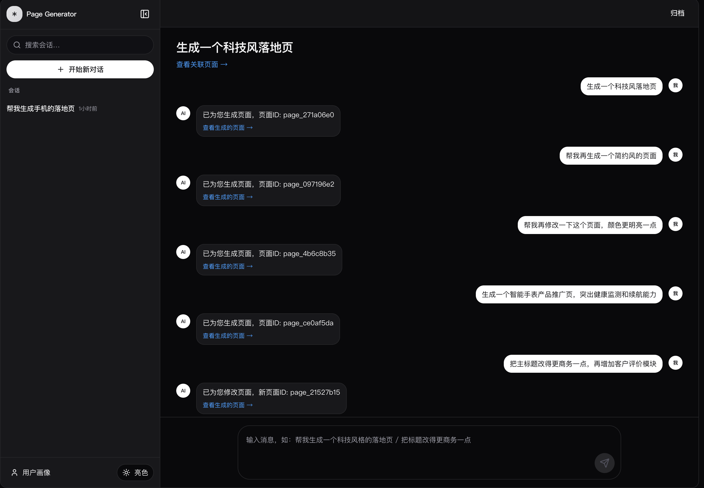

# Page Generator Agent

自然语言驱动的页面生成 Agent：输入一句话需求，Agent 自动规划 → 生成 → 反思 → 返回可预览、可多轮修改的页面。

## 项目背景

随着营销活动页、专题页、产品介绍页、解决方案页需求快速增加，原有人工搭建模式暴露出以下问题：

- 页面制作链路长，需求到交付周期偏慢
- 页面结构和内容高度依赖搭建人员经验
- 同类页面存在重复劳动，复用不足
- 非专业运营和实施人员难以高效产出页面

因此，团队希望在原有内容平台基础上，增加一层基于大模型的智能页面生成能力，让用户通过自然语言描述需求后，系统自动完成页面规划、组件生成、内容填充与预览。

### 建设目标

- 实现"一句话生成页面"的端到端能力
- 复用现有 Page Builder 组件体系和发布能力
- 缩短营销页和产品页初稿生成时间
- 支持多轮对话式修订，降低人工搭建成本
- 将页面生成链路纳入原有权限、审计、版本体系

### 项目定位

该项目不是重新建设一个低代码平台，而是在现有平台之上补充一层智能编排能力：

- **对上**承接自然语言需求输入
- **对中**通过 Agent 完成任务规划、工具调度、反思补齐
- **对下**复用 Page Builder、知识库/RAG、素材检索等基础能力

知识库以智能手表产品资料为示例场景，可替换为任意业务知识。这个项目用 Agent + LLM + RAG 把"自然语言需求 → 可预览页面"这一步自动化：用户只需描述想要的页面，Agent 调用工具生成 PageDSL，前端渲染为真实页面，并支持对话式多轮修改。

知识库以智能手表产品资料为示例场景，可替换为任意业务知识。

## 我的职责

独立设计并实现整个系统，包括：

- **Agent 工作流编排**：基于 LangGraph 实现 InputGuard → Plan → Execute → Reflect → Answer 五节点工作流，InputGuard 在入口拦截 Prompt Injection 与敏感输入，节点级执行追踪
- **结构化输出**：基于 Pydantic Model / JSON Schema 约束 LLM 输出，校验失败回退模板生成器
- **后端服务**：FastAPI 接口、Celery 异步任务调度、SQLite 生成记录库、JSONL 审计日志
- **会话记忆**：用户画像抽取与长会话摘要管道，结构化记忆写入 Elasticsearch 供长期检索
- **前端预览与编辑**：Next.js 动态渲染 PageDSL、组件级增量修订、会话式多轮修改
- **RAG 知识库**：Elasticsearch 向量 + 全文混合检索、查询改写、引用溯源
- **工程化**：Docker Compose 一键部署、Tool Harness 工具权限控制、多级降级、JSONL 离线评估集、LangSmith 可选 Trace

## 主要页面和功能

| 页面 | 路由 | 功能 |
|------|------|------|
| 首页 | `/` | 项目介绍与入口 |
| 会话列表 | `/conversations` | 历史会话与生成记录 |
| 会话详情 | `/conversations/[id]` | 对话式生成与多轮修改 |
| 页面预览 | `/preview/[pageId]` | 渲染生成的页面，支持继续修改 |

<!--  -->




核心能力：

- 自然语言生成落地页 / 产品页，支持选择页面类型与品牌风格
- 多轮对话修改，保留已有内容并按指令调整
- RAG 召回业务知识并溯源到引用片段
- 工具调用权限控制、输出合规检查、Prompt Injection 规则检查
- Agent 执行全程审计（工具调用、RAG 上下文、合规违规、节点失败）

## 技术栈

**前端**：Next.js 15、React 19、TypeScript、Tailwind CSS 4、Radix UI、Framer Motion、Zod

**后端**：FastAPI、Pydantic 2、LangGraph、Celery、Redis

**RAG**：Elasticsearch 8.15（向量 + 全文）、DashScope Embedding

**LLM**：DeepSeek（OpenAI 兼容协议）

**部署**：Docker Compose

## 项目架构



Agent 工作流：用户需求进入 `InputGuard` → `Plan` 拆解任务 → `Execute` 调用工具生成 PageDSL（RAG 上下文同时注入）→ `Reflect` 校验结构 → `Answer` 返回结果。Celery Worker 异步执行，SQLite 落库，前端通过 SSE 拉取进度。

## 本地启动

### 方式一：Docker Compose（推荐）

```bash
cp .env.example .env
# 在 .env 中填入 DEEPSEEK_API_KEY 和 DASHSCOPE_API_KEY

docker-compose up -d --build
docker-compose exec backend python -m scripts.build_index   # 构建知识索引
```

服务端口：

| 服务 | 端口 | 说明 |
|------|------|------|
| backend | 8000 | FastAPI 后端 |
| frontend | 5173 | 前端（需单独 `cd frontend && npm install && npm run dev`）|
| elasticsearch | 9200 | 知识库检索 |
| redis | 6379 | Celery broker |

### 方式二：本地开发（不用 Docker）

```bash
# 启动 Redis 和 ES
docker-compose up -d redis elasticsearch

# 后端
cd backend
python -m venv .venv && source .venv/bin/activate
pip install -r requirements.txt
export DEEPSEEK_API_KEY=xxx DASHSCOPE_API_KEY=xxx
export CELERY_BROKER_URL=redis://localhost:6379/0
export CELERY_RESULT_BACKEND=redis://localhost:6379/1
uvicorn app.main:app --reload --port 8000

# Worker（另开终端）
celery -A app.worker.celery_app worker --loglevel=info --concurrency=1

# 前端（另开终端）
cd frontend
npm install
npm run dev
```

浏览器打开 `http://127.0.0.1:5173`。

## 目录结构

```
backend/app/
  agent/           LangGraph Agent（Plan/Execute/Reflect/Answer）
    nodes/         节点实现
    tools/         页面生成与知识检索工具
    tool_harness.py 工具注册与权限控制
  routers/         API 路由（conversation、pages）
  services/        LLM 客户端、页面/知识库存储、安全合规、审计、Trace
  schemas/         PageDSL 协议与组件定义
  worker/          Celery 异步任务
frontend/
  app/             Next.js 页面（首页、会话、预览）
  components/      渲染器、会话组件、UI 组件
data/
  knowledge/       知识文档
  evals/           离线评估样例
  audit/           Agent 审计日志
  page_agent.sqlite3  生成记录与任务记录
```

## 环境变量

| 变量 | 必填 | 说明 |
|------|------|------|
| `DEEPSEEK_API_KEY` | 是 | LLM API Key |
| `DASHSCOPE_API_KEY` | 是 | Embedding API Key |
| `DEEPSEEK_MODEL` | 否 | 默认 `deepseek-v4-flash` |
| `RAG_ENABLED` | 否 | 默认 `true` |
| `RAG_TOP_K` | 否 | 默认 `3` |
| `SAFETY_ENABLED` | 否 | 默认 `true`，输出合规与 Prompt Injection 检查 |
| `LANGSMITH_ENABLED` | 否 | 默认 `false`，启用后上报 Trace |
